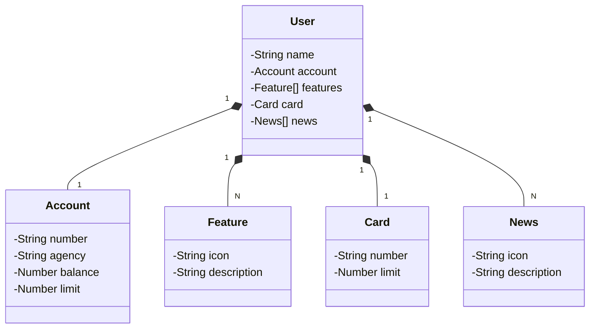
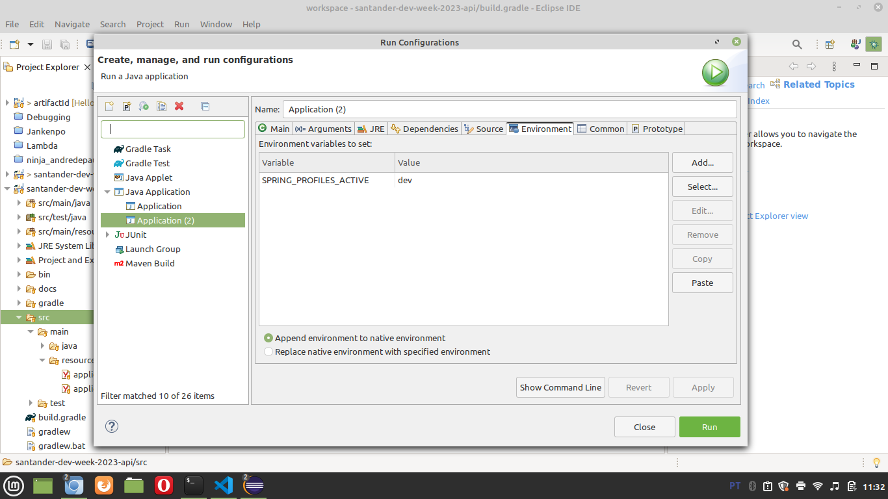

# General

[Link](https://web.dio.me/lab/publicando-sua-api-rest-na-nuvem-usando-spring-boot-3-java-17-e-railway/learning/138c435a-5be5-450b-a292-cf6ea002f54c?back=/play) of the challenge.


# Github source related to the project

Exploring the names related to the project in a Google search I found [this repository](https://github.com/digitalinnovationone/santander-dev-week-2023-api/).


# Generating the boilerplate

We generated the boilerplate in the [http://start.spring.io](http://start.spring.io) again. I tried to use the configurations more next to the teacher. These was the configurations that I selected:


I tried to make the same configuration as the teacher, used `Java 17`, but the Spring Boot version had to be newer because the course was recorded last year.

I had to change the port of the application because I already had an application running in the por 8080. I changed adding a file `application.properties` in the root directory with this content:

```
server.port = 8081
```

I renamed the main class as instructed by the teacher to `Application.java` (in src/main/java/dio/), had some changes in this file to reflect this new name and runned the appplication clicking with the left button over the class `Application.java` and selecting "`Run as > Java Application`".

To see the result, I opened "`http://127.0.0.1:8081`" in a browser and saw an error 404 (ok, an error, but the application was invoked = works).

Teacher saw the dependencied that we selected in Spring Initializr are in the file build.gradle (root directory).

Teacher shared with us [this content](https://www.figma.com/design/0ZsjwjsYlYd3timxqMWlbj/SANTANDER---Projeto-Web%2FMobile?node-id=1421-432) that is in Figma related to the API to be devfeloped.

Teacher developer this general JSON with ideas related to the content in Figma:


Grouping the informations in this JSON and improving:


I found [this json](https://github.com/digitalinnovationone/santander-dev-week-2023-api/blob/main/docs/mocks/find_one.json) in the Github repository of the project.


# Asking help for ChatGPT

As you can see in this image, teacher asked ChatGPT for help. Specifically, to generate a Mermaid diagram:


The answer was:


I got this Mermaid class diagram in the repository of the course and installed the extension "`Markdown Preview Mermaid Support`" to see the preview in VSCode.



Teacher passed use [this site](https://mermaid.js.org/) as the official website who talks about Mermaid. Teacher talked us that Mermaid is very powerful, supports several things, like relations and sequence diagram!

When I tried to copy some model classes from the official repository, I run into some problems. I am not very experienced with Gradle and I generated my imports in Spring Initializr. The versions are different, I already experienced a problem like this in an another project. Ok, I can copy some Gradle files from the DIO's repository, but I do not have time now for debugging (really serious). Instead, I forked (optional) the DIO repository [here](https://github.com/andreterceiro/santander-dev-week-2023-api), imported in Eclipse as a Gradle project (option "`Import`" and not open), changed the port of the application in the file `application.properties` and had a success when trying to run the project. Because I do not have too much time now, I will take notes here, I will see the files in that repository, but I will not try to reproduce the results prior to develop me version of the solution that I have to deliver.

I changed the strategy to change the port of the application. I removed the file `application.properties` and inserted the next configuration to the YML file `src/main/resources/application-dev.yml`. I have also to insert a environment variable in `Eclipse` in `Run -> Run configuration -> Environment`:



To be more clear, the environment variable was:

```
SPRING_PROFILES_ACTIVE = dev
```

**Important**: as you can see in the image, the equals sign do not exists. There are two fields.


# H2 console

To access `H2 Console`, please open the URL "`http://127.0.0.1:8085/h2-console`". The username, password and database that are requeried to connect are in the file `src/main/resources/application-dev.yml` (repository="https://github.com/andreterceiro/santander-dev-week-2023-api").


# Models

Teacher created the models. Please verify every file in the repository (https://github.com/andreterceiro/santander-dev-week-2023-api). Remember, unlike some other MVC implementations, in this strategy of implementation repositories to access databases are used, ok? In this application developed by teacher we have an UserRepository **interface** that extentds **JpaRepository **.